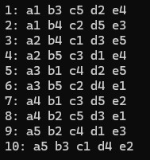
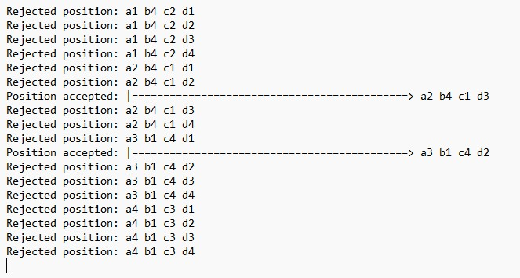
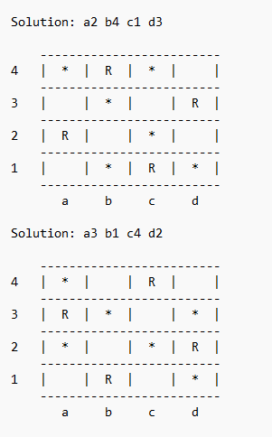

# The eight queens

## Introducción

El problema de las ocho reinas (the eight queens problem) es un problema clásico usado en el estudio de la algorítmica para ilustrar el esquema de *backtracking*. El problema clásico consiste en colocar ocho reinas sobre un tablero de ajedrez de 8x8 casillas de manera que no se ataquen entre ellas, teniendo en cuenta el movimiento de la reina según las reglas del ajedrez. En esta implementación, se resuelve en su forma general, es decir, se colocan N reinas sobre un tablero de ajedrez de NxN casillas. La salida del programa debe mostrar una lista numerada de soluciones, indicada mediante las coordenadas del tablero. Se ha fijado un límite de n = 13 ya que a partir de n > 13 se generan demasiadas soluciones. 

## Instrucciones
Para usar el programa, se copia el archivo *Queens.jar* en una carpeta a elección del usuario. A continuación, se abre el terminal del sistema operativo, se navega hasta la ubicación de la carpeta donde se copió el archivo con extensión .jar y se ejecuta el archivo mediante la siguiente sintáxis:

* `java -jar queens.jar [-t] [-g] [-h] n [fichero_salida]`

Los argumentos son los siguientes:
* `-t`: Traza cada paso de manera que describa la aplicación del algoritmo utilizado mostrando las posiciones rechazadas y las válidas. No se trazan las posiciones incompletas.
* `-g`: Modo gráfico. Se usa un formato visual que representa el tablero y la solución al problema.
* `-h`: Muestra la ayuda y sintaxis del comando de ejecución.

Opciones posibles:
* `java -jar queens.jar -h`
* `java -jar queens.jar n`
* `java -jar queens.jar -t n`
* `java -jar queens.jar n fichero_salida`
* `java -jar queens.jar -g n fichero_salida`
* `java -jar queens.jar -t n fichero_salida`
* `java -jar queens.jar -t -g n fichero_salida`

*Consideraciones*: El tamaño del tablero debe ser un número entero positivo, mayor que cero y menor o igual a 13, en caso contrario, el programa mostrará un error. Además, el archivo de salida debe tener extensión .txt o la aplicación mostrará un error. Se genera un log que guarda todos los eventos que ocurren en el programa. 

## Imágenes de muestra
A continuación, se pueden ver unas imágenes de muestra del programa.

* Solución al problema visto en el cmd con n = 5.
  

* Traza del problema para n = 4.

* Solución gráfica del problema para n = 4. El asterisco representa una casilla negra y la letra "R" a una reina.

## Licencia
Este proyecto está licenciado bajo la Licencia Pública General GNU v3 (GPLv3).

© 2025 Roberto Castillejo Embid. 
Consulte el archivo [LICENSE](./LICENSE) para más detalle.
